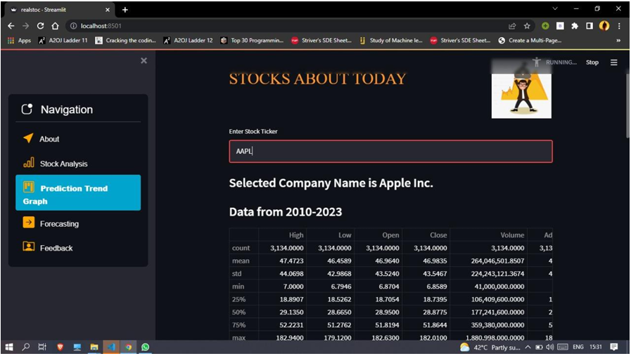

# Stock Price Prediction

## Overview
This project focuses on predicting stock prices using **Long Short-Term Memory (LSTM) networks** and **Machine Learning** techniques. The model is trained on historical stock data and deployed as an interactive **Streamlit web application** for real-time predictions.

## Features
- **Stock Price Prediction** using LSTM and Linear Regression
- **Real-time Data Fetching** via Yahoo Finance API
- **Interactive Visualizations** with Streamlit
- **Model Training and Evaluation**
- **Historical vs. Predicted Stock Price Comparison**

## Dataset
The dataset is sourced from **Yahoo Finance API** and consists of attributes:
- Date
- Open Price
- High Price
- Low Price
- Close Price
- Volume

The data is split as:
- **70% Training**
- **30% Testing**

## Technologies Used
| Technology      | Purpose |
|---------------|---------|
| Python        | Programming Language |
| NumPy         | Numerical Computation |
| Pandas        | Data Manipulation |
| Matplotlib    | Data Visualization |
| TensorFlow/Keras | Machine Learning Model |
| Scikit-learn  | Preprocessing & Evaluation |
| Yahoo Finance API | Stock Data Retrieval |
| Streamlit     | Web App Framework |

## Installation
### 1. Clone the Repository
```sh
git clone https://github.com/your-username/stock-price-prediction.git
cd stock-price-prediction
```

### 2. Create a Virtual Environment
```sh
python -m venv env
source env/bin/activate  # On macOS/Linux
env\Scripts\activate     # On Windows
```

### 3. Install Dependencies
```sh
pip install -r requirements.txt
```

### 4. Run the Application
```sh
streamlit run app.py
```

## Usage
1. Open the **Streamlit Web App**.
2. Enter the **Stock Ticker Symbol** (e.g., `AAPL` for Apple).
3. View **historical trends and predictions**.
4. Analyze the **Predicted vs. Actual Prices**.

## Project Structure
```
📂 stock-price-prediction
 ├── 📜 app.py             # Streamlit Web App
 ├── 📜 model.py           # Machine Learning Model (LSTM)
 ├── 📜 data_loader.py     # Data Preprocessing & Fetching
 ├── 📜 requirements.txt   # Dependencies
 ├── 📜 README.md          # Project Documentation
 ├── 📂 datasets           # Sample Stock Data
 ├── 📂 models             # Trained Model Files
 ├── 📂 static             # CSS & Images for UI
 ├── 📂 templates          # Streamlit UI Templates
```

## Results
- **LSTM Model** provided accurate predictions with increased training.
- **Graphical analysis** improved understanding of stock price movements.
- **Potential Improvements** include additional financial indicators for accuracy.

## Screenshots



## References
- [Pandas Documentation](https://pandas.pydata.org/docs/)
- [Matplotlib Documentation](https://matplotlib.org/stable/index.html)
- [Keras API](https://keras.io/api/layers/)
- [Streamlit Documentation](https://docs.streamlit.io/)
- [Yahoo Finance API](https://python-yahoofinance.readthedocs.io/en/latest/api.html)
- [LSTM Algorithm](https://www.geeksforgeeks.org/long-short-term-memory-networks-explanation/)
